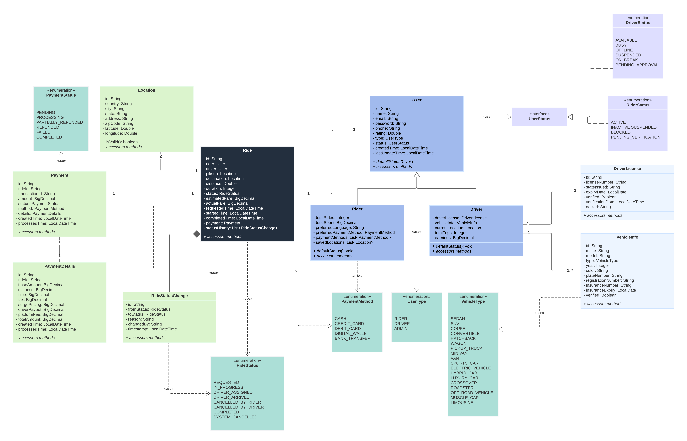
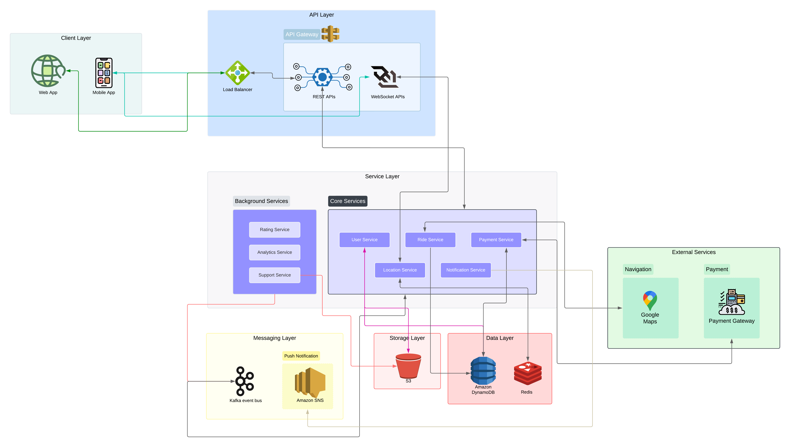

# Architecture of Massively Distributed Applications

# ECIUber

## Summary

The goal of this lab is to design a microservices architecture for a ridesharing platform like Uber (called ECIUber). Key resources such as trips, drivers, users, and payments must first be identified and modeled through object modeling techniques such as class diagrams. Each resource has a standardized representation in JSON format, to facilitate consistent interactions between services. Model URIs were created for these resources to establish organized endpoints, and appropriate HTTP methods (e.g., GET to retrieve trip details, POST to send trip requests) were assigned according to RESTful principles. The architecture ensures scalability and supports real-time communication, which can be achieved by leveraging AWS cloud-based services such as API Gateway and Lambda functions for backend processes. Finally, a simple prototype is implemented to demonstrate the functionality of the architecture, integrating features such as real-time tracking and driver management to improve user experience and operational efficiency.

## Features

### Modeling



## Architecture

### Overview

This ride-sharing platform is built using Java 21 and Spring Boot, leveraging AWS cloud services to create a scalable and maintainable solution. The architecture follows a modern microservices pattern, organized into distinct layers that work together while maintaining clear separation of concerns. Each layer serves a specific purpose and communicates with others through well-defined interfaces.




### Client Layer
The client layer represents the entry points for user interactions with our platform. It consists of mobile applications for riders and drivers, along with web interfaces for administration and support.

#### Mobile Applications
The rider and driver applications serve as the primary touchpoints for our end users. These applications are built with real-time capabilities, enabling instant updates for location tracking and ride status changes. The rider app allows users to request rides, track their journey, and manage their accounts, while the driver app provides specialized features for accepting rides, navigation, and earnings management.

#### Web Applications
Our web interfaces cater to administrative and support functions. The admin dashboard provides system-wide monitoring and management capabilities, while the support portal enables customer service representatives to handle user inquiries efficiently. Both applications are secured through role-based access control and integrate seamlessly with our backend services.

### API Layer
The API layer manages all incoming traffic and serves as the gateway between clients and our backend services. It includes:

#### Load Balancer
Our Application Load Balancer (ALB) ensures high availability and efficient traffic distribution. It performs health checks, handles SSL/TLS termination, and enables sophisticated deployment strategies like A/B testing and canary releases.

#### API Gateway
The gateway provides two types of APIs:
- REST APIs for standard operations and business transactions
- WebSocket APIs for real-time features such as location tracking and ride status updates

The gateway implements authentication, rate limiting, and request validation, ensuring secure and controlled access to our services.

### Service Layer
The service layer contains our core business logic, divided into two main categories:

#### Core Services
These services handle the fundamental operations of our platform:
- User Service: Manages user profiles and authentication
- Ride Service: Coordinates ride matching and lifecycle management
- Payment Service: Handles all financial transactions
- Location Service: Processes real-time location data
- Notification Service: Manages communication across various channels

#### Support Services
These services enhance platform functionality:
- Analytics Service: Processes business intelligence data
- Rating Service: Manages user feedback systems
- Support Service: Handles customer support operations

### Storage Layer
The storage layer represents a significant architectural enhancement, providing centralized management of file storage operations. This layer consists of:

#### Storage Service
A dedicated microservice that acts as a gateway for all file storage operations. It provides:
- Centralized file upload and download capabilities
- Generation of pre-signed URLs for direct S3 access
- Consistent file organization through folder structures
- Security policy enforcement for file access

The storage service abstracts the complexity of S3 interactions, offering a clean interface for other services to manage their storage needs. This centralization ensures consistent handling of files across the platform and simplifies security management.

#### S3 Storage
Amazon S3 serves as our primary object storage solution, organized into logical containers for different types of files:
- User documents
- Trip receipts
- System backups
- Support documentation

### Messaging Layer

Our messaging layer implements a hybrid approach using both Apache Kafka and Amazon SNS to handle different types of messaging requirements effectively. This dual-messaging strategy allows us to leverage the strengths of each technology for specific use cases.

#### Apache Kafka Event Bus

Kafka serves as our primary event bus for handling high-throughput, mission-critical event streams. We use Kafka for scenarios that require:

Event Processing and State Management:
- Ride status updates and tracking
- Driver location changes
- Payment processing events
- User preference updates

Our Kafka implementation uses topic partitioning to ensure ordered message delivery within specific business contexts. For example, all events related to a specific ride are guaranteed to be processed in order by using the ride ID as the partition key.

Example Kafka event flow for ride status updates:

```java
@Service
public class RideEventProcessor {
    private final KafkaTemplate<String, RideEvent> kafkaTemplate;

    public void publishRideStatusChange(String rideId, RideStatus newStatus) {
        RideEvent event = RideEvent.builder()
            .rideId(rideId)
            .status(newStatus)
            .timestamp(Instant.now())
            .build();

        // Using rideId as the key ensures ordered processing
        kafkaTemplate.send("ride-events", rideId, event);
    }
}
```

#### Amazon SNS Integration

We utilize Amazon SNS for broad message distribution scenarios, particularly when messages need to be delivered to multiple subscribers or external systems. SNS handles:

Notification Distribution:
- User notifications (mobile push, SMS, email)
- System alerts and monitoring
- Cross-region event propagation
- Integration with external services

Our SNS implementation uses topic-based routing with different protocols for various notification channels:

```java
@Service
public class NotificationService {
    private final AmazonSNS snsClient;

    public void sendRideNotification(String userId, NotificationType type, String message) {
        String topicArn = getTopicForNotificationType(type);

        PublishRequest request = new PublishRequest()
            .withTopicArn(topicArn)
            .withMessage(message)
            .withMessageAttributes(Map.of(
                "userId", new MessageAttributeValue()
                    .withDataType("String")
                    .withStringValue(userId)
            ));

        snsClient.publish(request);
    }
}
```

#### Messaging Layer Architecture

The messaging layer implements several key patterns:

Message Routing:
- Kafka handles service-to-service event streaming where ordering and replay capabilities are crucial
- SNS manages fan-out scenarios where multiple subscribers need immediate notification

Message Reliability:
- Kafka provides message persistence and replay capabilities
- SNS ensures at-least-once delivery with automatic retries

Message Filtering:
- Kafka uses consumer groups for load balancing
- SNS uses subscription filters for message routing

Example of how we combine both systems:

```java
@Service
public class RideCompletionProcessor {
    private final KafkaTemplate<String, RideEvent> kafkaTemplate;
    private final AmazonSNS snsClient;

    public void handleRideCompletion(String rideId) {
        // Publish state change to Kafka for system processing
        RideEvent event = createRideCompletionEvent(rideId);
        kafkaTemplate.send("ride-completions", rideId, event);

        // Send notifications via SNS for external communication
        NotificationMessage notification = createCompletionNotification(rideId);
        publishToSns("ride-notifications", notification);
    }
}
```

#### Message Flow Control

We implement sophisticated flow control mechanisms:

Back-pressure Handling:
- Kafka consumer groups with manual commit management
- SNS delivery retry policies with dead-letter queues

Error Handling:
- Kafka error topics for failed message processing
- SNS delivery status monitoring and alerting

Monitoring and Observability:
- Message throughput metrics
- Processing latency tracking
- Dead letter queue monitoring
- Message delivery success rates

This hybrid messaging approach provides us with a robust, scalable, and flexible communication infrastructure that can handle both real-time event processing and broad message distribution requirements while maintaining high reliability and performance.

### Data Layer
The data layer manages persistent storage through specialized databases:

#### DynamoDB
Our NoSQL database handles:
- User profiles
- Ride records
- Transaction history
- System configurations

#### Redis
An in-memory cache for:
- Session data
- Real-time location information
- Temporary data storage
- Rate limiting information

### External Services
Our platform integrates with various third-party services:
- Payment Gateway: For secure payment processing
- Maps Service: For navigation and geocoding
- Email Service: For transactional emails
- SMS Service: For mobile notifications

## Technical Implementation

### Technology Stack
- Language: Java 21
- Framework: Spring Boot 3.2.0, Spring Cloud
- Build Tool: Maven (multi-module project)
- Cloud Platform: AWS
- Message Broker: Apache Kafka
- Monitoring: CloudWatch, Prometheus, Grafana

## Architectural Patterns and Best Practices

Our ride-sharing platform implements several architectural patterns and best practices that work together to create a robust, maintainable, and scalable system. Let's explore each pattern and understand how it benefits our platform.

### Domain-Driven Design (DDD)

We've organized our services around business domains rather than technical functions. This approach helps maintain clear boundaries and promotes better understanding of the business logic. For example:

The Ride Service domain encompasses everything related to ride management:
```java
public class Ride {
    private RideId id;
    private UserId passengerId;
    private DriverId driverId;
    private RideStatus status;
    private Money fare;
    private Location pickup;
    private Location destination;
    private Timeline timeline;
}
```

This rich domain model captures the essential business concepts and rules, making the code more intuitive and maintainable. We've used value objects for concepts like RideId and Money to enforce invariants and express domain rules clearly:

```java
@Value
public class Money {
    private BigDecimal amount;
    private Currency currency;

    public Money add(Money other) {
        if (!this.currency.equals(other.currency)) {
            throw new InvalidCurrencyException("Cannot add different currencies");
        }
        return new Money(this.amount.add(other.amount), this.currency);
    }
}
```

### Event-Driven Architecture

Our platform uses events to enable loose coupling between services while maintaining data consistency. We've implemented this pattern through Kafka, with events representing significant business occurrences:

```java
public class RideEvent {
    private EventType type;
    private RideId rideId;
    private Instant timestamp;
    private Map<String, String> metadata;

    public enum EventType {
        REQUESTED,
        DRIVER_ASSIGNED,
        STARTED,
        COMPLETED,
        CANCELLED
    }
}
```

Services publish events when they make significant state changes, and other services react to these events asynchronously. For example, when a ride is completed:

```java
@Service
public class RideCompletionHandler {
    @Transactional
    public void handleRideCompletion(RideId rideId) {
        // Update ride status
        rideService.markAsCompleted(rideId);

        // Publish completion event
        eventPublisher.publish(new RideEvent(
            EventType.COMPLETED,
            rideId,
            Instant.now()
        ));
    }
}

@Service
public class PaymentInitiationService {
    @KafkaListener(topics = "ride-events")
    public void handleRideEvent(RideEvent event) {
        if (event.getType() == EventType.COMPLETED) {
            initiatePaymentProcess(event.getRideId());
        }
    }
}
```

### CQRS (Command Query Responsibility Segregation)

We've separated our read and write operations to optimize for different requirements. This pattern is particularly valuable in our ride-matching system:

```java
// Command side - optimized for writes
@Service
public class RideCommandService {
    public void createRide(CreateRideCommand command) {
        Ride ride = new Ride(command);
        rideRepository.save(ride);
        eventPublisher.publish(new RideCreatedEvent(ride));
    }
}

// Query side - optimized for reads
@Service
public class RideQueryService {
    public RideSearchResult findNearbyRides(Location location, Radius radius) {
        return rideReadRepository.findNearby(location, radius);
    }
}
```

### Gateway Pattern

Our Storage Service implements the Gateway pattern to provide a unified interface for file operations:

```java
@Service
public class StorageService {
    private final S3Client s3Client;
    private final FileValidator validator;
    private final SecurityService security;

    public String storeFile(FileContent content, FileMetadata metadata) {
        // Validate file
        validator.validate(content, metadata);

        // Check permissions
        security.checkPermissions(metadata.getOwner(), "write");

        // Generate unique key
        String key = generateKey(metadata);

        // Store file
        s3Client.putObject(buildPutRequest(key, content, metadata));

        return key;
    }
}
```

This pattern provides several benefits:
- Centralized security enforcement
- Consistent error handling
- Simplified client code
- Better resource management

### Circuit Breaker Pattern

We use circuit breakers to handle failures gracefully, especially for external service calls:

```java
@Service
public class PaymentService {
    private final CircuitBreaker circuitBreaker;

    public PaymentResult processPayment(Payment payment) {
        return circuitBreaker.run(
            () -> paymentGateway.process(payment),
            throwable -> handlePaymentFailure(payment, throwable)
        );
    }
}
```

### Saga Pattern

For distributed transactions, we implement the Saga pattern to maintain data consistency:

```java
@Service
public class RideCompletionSaga {
    public void execute(RideId rideId) {
        try {
            // Step 1: Complete ride
            rideService.completeRide(rideId);

            // Step 2: Process payment
            paymentService.processRidePayment(rideId);

            // Step 3: Update driver availability
            driverService.updateAvailability(rideId);

        } catch (Exception e) {
            // Compensating transactions
            compensate(rideId, e);
        }
    }
}
```

### Best Practices in Implementation

Throughout our implementation, we follow several key best practices:

1. Immutability: We use immutable objects wherever possible to prevent bugs and make code easier to reason about:

```java
@Value
public class RideRequest {
    private final UserId passengerId;
    private final Location pickup;
    private final Location destination;
    private final LocalDateTime requestTime;
}
```

2. Defensive Programming: We validate inputs and handle edge cases explicitly:

```java
public void validateRideRequest(RideRequest request) {
    Objects.requireNonNull(request, "Ride request cannot be null");
    Objects.requireNonNull(request.getPassengerId(), "Passenger ID is required");
    validateLocation(request.getPickup(), "Pickup");
    validateLocation(request.getDestination(), "Destination");

    if (request.getPickup().equals(request.getDestination())) {
        throw new InvalidRideRequestException("Pickup and destination cannot be the same");
    }
}
```

3. Separation of Concerns: Each component has a single, well-defined responsibility:

```java
// Handles ride matching logic
public class RideMatcher {
    public Optional<Driver> findBestMatch(RideRequest request) {
        // Matching logic
    }
}

// Handles driver availability
public class DriverAvailabilityService {
    public List<Driver> getAvailableDrivers(Location location, Radius radius) {
        // Availability logic
    }
}
```

4. Interface Segregation: We define focused interfaces that serve specific client needs:

```java
public interface RideReader {
    Optional<Ride> findById(RideId id);
    List<Ride> findByPassenger(UserId passengerId);
}

public interface RideWriter {
    void save(Ride ride);
    void update(RideId id, RideStatus status);
}
```

These patterns and practices work together to create a system that is both robust and maintainable, while remaining flexible enough to adapt to changing business requirements.

### Security Implementation
- JWT-based authentication
- Role-based access control
- API rate limiting
- Data encryption at rest and in transit
- Centralized storage access control

### Scalability Features
- Horizontal scaling of services
- Auto-scaling based on demand
- Caching strategies
- Database sharding
- Content delivery network integration

# Container Infrastructure and Deployment Guide

## Overview of Containerization Strategy

Our ride-sharing platform employs a sophisticated containerization approach using Docker to ensure consistent deployment across all environments while maintaining service isolation. Each microservice operates within its own container, enabling independent scaling and simplified dependency management.

## Service Container Specifications

We use a multi-stage build process in our Dockerfiles to create efficient, production-ready container images. This approach significantly reduces the final image size by separating the build environment from the runtime environment. Here's an example of our standard Dockerfile structure:

```dockerfile
# Stage 1: Build environment
FROM maven:3.8.4-openjdk-21-slim as builder

# Set up build workspace
WORKDIR /app

# Copy essential build files
COPY pom.xml .
COPY common common/
COPY user-service user-service/

# Execute build process
RUN mvn clean package -pl user-service -am -DskipTests

# Stage 2: Runtime environment
FROM openjdk:21-slim

# Copy only the built application
COPY --from=builder /app/user-service/target/*.jar app.jar

# Define the startup command
ENTRYPOINT ["java", "-jar", "/app.jar"]
```

## Service Orchestration Configuration

Our service orchestration is managed through Docker Compose, which defines how our services interact and ensures they have access to necessary resources. Here's our complete orchestration configuration:

```yaml
version: '3.8'

services:
  # API Gateway Service
  api-gateway:
    build:
      context: .
      dockerfile: api-gateway/Dockerfile
    ports:
      - "8080:8080"
    environment:
      - SPRING_PROFILES_ACTIVE=docker
      - SPRING_CLOUD_GATEWAY_ROUTES_0_URI=http://user-service:8081
      - SPRING_CLOUD_GATEWAY_ROUTES_1_URI=http://ride-service:8082
    networks:
      - ride-sharing-network
    depends_on:
      - user-service
      - ride-service

  # User Management Service
  user-service:
    build:
      context: .
      dockerfile: user-service/Dockerfile
    ports:
      - "8081:8081"
    environment:
      - SPRING_PROFILES_ACTIVE=docker
      - SPRING_DATA_DYNAMODB_ENDPOINT=http://dynamodb-local:8000
      - KAFKA_BOOTSTRAP_SERVERS=kafka:9092
    networks:
      - ride-sharing-network
    depends_on:
      - dynamodb-local
      - kafka

  # Ride Management Service
  ride-service:
    build:
      context: .
      dockerfile: ride-service/Dockerfile
    ports:
      - "8082:8082"
    environment:
      - SPRING_PROFILES_ACTIVE=docker
      - SPRING_DATA_DYNAMODB_ENDPOINT=http://dynamodb-local:8000
      - KAFKA_BOOTSTRAP_SERVERS=kafka:9092
      - REDIS_HOST=redis
    networks:
      - ride-sharing-network
    depends_on:
      - dynamodb-local
      - kafka
      - redis

  # Database Service (DynamoDB Local)
  dynamodb-local:
    image: amazon/dynamodb-local:latest
    ports:
      - "8000:8000"
    command: ["-jar", "DynamoDBLocal.jar", "-sharedDb"]
    volumes:
      - dynamodb-data:/home/dynamodblocal/data
    networks:
      - ride-sharing-network

  # Caching Service
  redis:
    image: redis:6.2-alpine
    ports:
      - "6379:6379"
    command: redis-server --appendonly yes
    volumes:
      - redis-data:/data
    networks:
      - ride-sharing-network

  # Event Streaming Services
  zookeeper:
    image: confluentinc/cp-zookeeper:latest
    environment:
      ZOOKEEPER_CLIENT_PORT: 2181
      ZOOKEEPER_TICK_TIME: 2000
    networks:
      - ride-sharing-network

  kafka:
    image: confluentinc/cp-kafka:latest
    depends_on:
      - zookeeper
    ports:
      - "9092:9092"
    environment:
      KAFKA_BROKER_ID: 1
      KAFKA_ZOOKEEPER_CONNECT: zookeeper:2181
      KAFKA_ADVERTISED_LISTENERS: PLAINTEXT://kafka:9092
      KAFKA_OFFSETS_TOPIC_REPLICATION_FACTOR: 1
    networks:
      - ride-sharing-network

# Persistent Storage Definitions
volumes:
  dynamodb-data:
  redis-data:

# Network Configuration
networks:
  ride-sharing-network:
    driver: bridge
```

## Deployment Process

Follow these steps to deploy the system:

1. Environment Configuration
   Create a `.env` file in your project root with the following settings:
   ```bash
   AWS_ACCESS_KEY_ID=your_access_key
   AWS_SECRET_ACCESS_KEY=your_secret_key
   AWS_REGION=your_region
   AWS_S3_BUCKET=your_bucket_name
   ```

2. Service Deployment
   Execute these commands to manage your containers:
   ```bash
   # Start all services
   docker-compose up --build -d

   # Monitor deployment status
   docker-compose ps

   # View service logs
   docker-compose logs -f service-name

   # Stop all services
   docker-compose down
   ```

## Development Environment Setup

For local development, you can start services selectively:

1. Launch Infrastructure Services
   ```bash
   # Start supporting services only
   docker-compose up -d dynamodb-local redis kafka
   ```

2. Run Individual Services
   ```bash
   # Start specific service with rebuilding
   docker-compose up -d --build user-service
   ```

3. Monitor Service Logs
   ```bash
   # Stream logs from specific service
   docker-compose logs -f user-service
   ```

## Resource Management

Each service includes specific resource constraints to ensure optimal performance:

```yaml
deploy:
  resources:
    limits:
      cpus: '1'
      memory: 1G
```

## Health Monitoring

We implement health checks for each service to ensure reliability:

```yaml
healthcheck:
  test: ["CMD", "curl", "-f", "http://localhost:8081/actuator/health"]
  interval: 30s
  timeout: 10s
  retries: 3
```

## Benefits of Our Container Architecture

Our containerization strategy provides several key advantages:

1. Environment Consistency: Ensures identical behavior across development, testing, and production environments.
2. Independent Scaling: Allows services to scale based on their specific demands.
3. Resource Isolation: Prevents resource conflicts between services.
4. Simplified Deployment: Streamlines the deployment process through automation.
5. Enhanced Monitoring: Provides detailed insights into service health and performance.

This container infrastructure forms the foundation of our microservices architecture, enabling efficient development, testing, and deployment workflows while maintaining system reliability and scalability.
